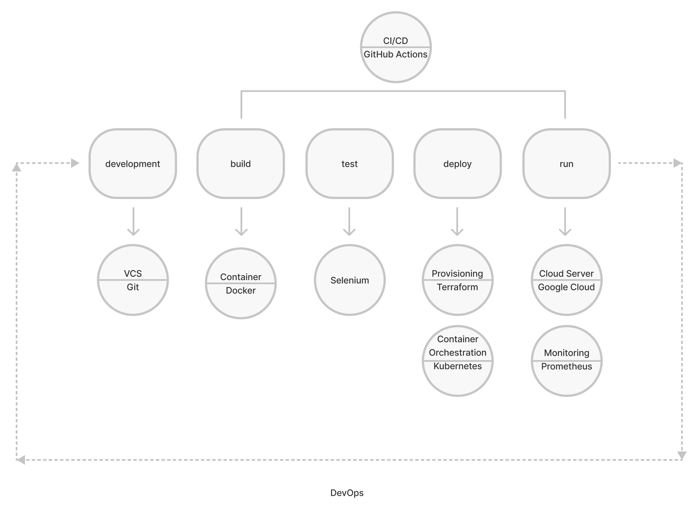

# The Life Cycle of the Application

Application life cycle begins with the decision to create a software product and ends when it is completely taken out of service. It involves such processes as continuous: development, integration, testing, deployment and monitoring.

**Continuous Development**

Continuous Development includes planning and programming the application. At this stage, a programming language should be chosen for developing the application, as well as a tool for maintaining the code (also known as a Version Control System (VCS)). The programming language and VCS can be chosen depending on the preferences of the developers and team members. 
The most popular programming languages are Python, C++, Node.js, Ruby etc. And among the most common VCSs can be distinguished Git, JIRA, Mercurial and others.

**Continuous Integration**

Continuous Integration (CI) starts from the commit of the code changes to the master branch in VCS. This step triggers building of the application. However we want to make sure that our changes don't cause any new issues. 

**Continuous Testing**

So the next step is running different types of tests such as unit tests, integration tests etc. on the build package. Once tests run successfully we can confirm that the build cycle is complete.
 
Popular tools: Selenium, TestNG, JUnit etc.

**Continuous Delivery/Deployment**

At this stage our new version of the application will be released. Continuous Delivery prepares code changes to be released to production. It puts the build application in a package and makes it available for users to download and deploy in their own environments. Continuous Deployment takes the packaged application and automatically deploys it in a target environment.
In short, CI/CD represents a process when an application code is changed and pushed to the code repository, automatically built, tested and then released and deployed in production to a target environment without requiring any manual intervention.
Popular CI/CD tools: Gitlab CI, Jenkins, GitHub Actions etc.

**Continuous Monitoring**

Another important part of the life cycle of the application is continuous monitoring. it tests the performance metrics and functionality of the application. Issues such as problems with the network, server, memory etc. are automatically resolved at this stage. And if more serious and complex errors are found, then this information will be transferred to the developer team so that they can fix them at the Continuous Development stage. So the Continuous Monitoring ensures the availability and high efficiency of the application.
Popular tools: Prometheus, Lansweeper, Nagios etc.

**Resume**

Deployment is a huge and important part of the application lifecycle. It can be done manually but then it is a very tedious task which can cause many errors and most likely we would constantly postpone it. But by doing deployment as infrequently as possible we would lose a great opportunity to gather feedback on each small or big change of code and release new versions more often. 

# Automation Steps

Pushing the changes in development environment to the master branch will cause the next automation steps:

* app building
*containerization of the app itself and databank
* testing
* (after successful testing) deployment on Google Cloud 
* provisioning of infrastructure
* container orchestration 
* app running on the Google Cloud
* monitoring of the app performance

The automation cycle will be repeated every time the changes in code will be done and pushed to the master branch.

# Architecture of the Infrastructure

**Version Control System: Git**
Git allows developers to push changes, merge branches and control different versions of the code easily. Among other advantages of Git over other VCSs are high speed of work, data assurance and working on multiple independent branches at the same time.

**CI/CD: GitHub Actions**
GitHub Actions is a software that accompanies an application from building stage to deployment to the server and to the end user. GitHub Actions is one of the most widely used CI/CD tools and therefore it will be useful to learn how to work with it.

**Container: Docker**
Docker allows the deployment of applications on the server. Containers hold all packages and dependencies which will be packed and installed on the server. 

**Testing: Selenium**
Any changes made in the code must be reviewed and tested before the new version of the application is deployed. Selenium is the automated testing framework. Selenium test scripts check out the code changes whether they cause any errors and make sure that the application works fine. 
 
**Provisioning: Terraform**
Infrastructure as code (IaC) allows provisioning to be automated so that DevOps developers don’t have to  provision and manage the infrastructure manually. Automated provisioning means that configuration files are created, which contain the infrastructure specifications of the application. Thus, provisioning and managing of infrastructure is done automatically through the code.

**Container Orchestration: Kubernetes**
Container orchestration can be used in any environment where containers are used during application deployment. It usually takes a lot of time and effort to manually set configurations for a single container. Container orchestration automates this process for all containers.

**Cloud Server: Google Cloud**
A cloud server is a powerful virtual machine that runs applications and serves as a repository for processed information. An application must be located on the server so end users can reach and use it.  

**Monitoring: Prometheus**
The application must be constantly monitored in order to record and use real-time metrics. Access to the metrics allows DevOps developers to detect any problems during any stage of the DevOps pipeline. Thus, transparency and visibility of all actions and their impact on the operation of the application will be created. Thanks to monitoring, in case of any problems, appropriate measures will be taken in time to prevent any serious consequences and improve the performance of the application.

# Resources:

* DevOps Lectures Wintersemester 2021/2022
* https://www.redhat.com/en/topics/containers/what-is-container-orchestration 
* https://www.redhat.com/en/topics/automation/what-is-provisioning
* https://jelvix.medium.com/application-development-lifecycle-is-a-period-of-time-that-begins-with-the-decision-to-create-a-dccf60b78fb0
* https://www.edureka.co/blog/devops-lifecycle/#whatisdevopslifecycle
* https://www.browserstack.com/guide/continuous-monitoring-in-devops 
